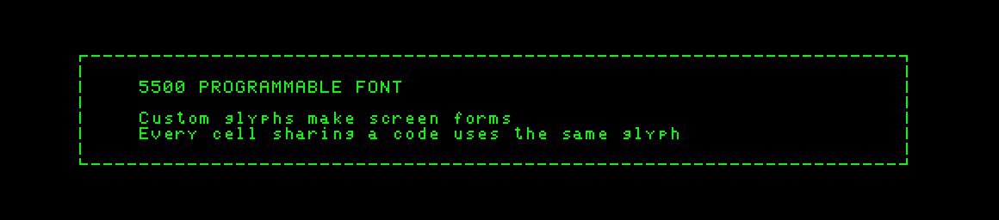
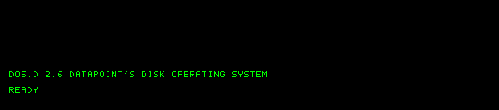

# Datapoint 5500 programmable display

## What initializes the display?

The font is RAM, not a permanent character generator. The 5500 power-up ROM
loads its minimum character set through the normal screen I/O instructions.
There is no need for an invented host font to make 5500 mode work: execute
`RESTART` after selecting `CPU=5500` and wait for initialization to finish.
The simulator initializes font RAM to zero for deterministic startup; real
power-up RAM contents are undefined.

The [5500 hardware reference, section 3](https://bitsavers.org/pdf/datapoint/5500/06181-02_Datapoint_5500_Product_Specification_and_Hardware_Reference_Manual_19770527.pdf)
describes 128 programmable 5×7 glyphs and a separate 80×12 array of character
codes. Each glyph takes five column bytes: bit `0100` is the top dot and bit `1`
the bottom dot. `EX COM4` selects a glyph and subsequent `EX WRITE` operations
load columns; after five columns, loading proceeds to the next glyph. `EX COM1`
returns to screen-writing mode. Screen erasure writes code `040`, so redefining
space also changes what an erased cell looks like.

## Why DOS was leaving the ROM font unchanged

The simulator's screen status originally returned only the ready and keyboard
bits. The [Quick Reference Guide, printed page 4](https://bitsavers.org/pdf/datapoint/60311_Quick_Reference_Guide_For_Datapoint_Processors_and_Peripherals_2ed.pdf)
defines bit 4 (`020`) as the high-speed RAM-display option. DOS checks this bit
in its RAM-screen loader, at octal PC `007651`–`007656` in the supplied version.
Without it, DOS considers the RAM display absent and skips loading its font.

This bit is now returned by the implemented RAM display in both UI and headless
mode. No DOS disk patches were needed.

## What the supplied DOS.D 2.6 loads

Measured by running the actual ROM and the installed DOS.D bootstrap:

| Stage | Font-byte writes, cumulative | Result |
| --- | ---: | --- |
| ROM power-up | 665 | Minimum ROM character set; repeated patterns remain in many other glyph slots. |
| DOS reaches READY | 1,305 | DOS loads another 640 bytes: all 128 glyphs. |
| CAT :D0 returns | 1,305 | Catalogue uses the existing DOS font. |

**89 of the 128 glyphs differ** between the final ROM and DOS fonts. Uppercase
letters and digits mostly match; DOS adds its punctuation, lowercase letters,
and control-code representations. For example, glyph `141` is lowercase `a`,
with columns `[006, 025, 025, 017, 001]`. The DOS RAM-display flag at `01377`
is now set (`052` in this boot).

The [DOS 2.6 user's guide](https://bitsavers.org/pdf/datapoint/software/50432_DOS_Users_Guide_Version_2.6_May80.pdf),
sections 49.5, 52.11 and 54.2, identifies `SYSTEM6/SYS` as the screen overlay.
DOS normally gets its font there, with `CHARSET/SYS` taking precedence when
present. Function 11 offers subfunctions to load a list of glyphs, load one
glyph, or request restoration of the standard font on a later return to DOS.
Applications can therefore change the font without replacing DOS.

The API uses A=11 (decimal), C=subfunction, B=default glyph, and HL pointing to
the definition. A glyph definition has five column bytes, optionally preceded
by a character selector with its high bit set. List loading uses `0200` as its
terminator. Consult section 52.11 for return flags and list-format restrictions.

The [September 1982 software catalogue](https://bitsavers.org/pdf/datapoint/software/60000_Datapoint_Software_Catalog_Sep1982.pdf),
printed pages 3-31 and 3-32, documents two relevant utilities:

- **CHAREDIT** edits `CHARSET/SYS` font definitions and keyboard translation files.
- **CHARINTL** installs a selection of international display character sets,
  including Scandinavian characters, for subsequent system starts.

Their media have not been tested here. Question 6 in [questions.md](../../questions.md)
asks whether copies are available.

## Graphics and forms

Custom line segments, corners, symbols, blocks, and tile patterns are possible.
Changing a glyph changes every screen cell containing its code immediately;
it does not require rewriting those cells. This shared-glyph behavior is now
handled by the SDL repaint logic.

An important consequence of the hardware layout is that this is tile graphics,
not a separately addressable full-screen bitmap. There are 960 cells but only
128 distinct glyph patterns at a time. Each cell selects one of those patterns.
The glyph dots occupy 400×84 positions across the screen, excluding spacing;
that count does not imply independently programmable pixels at every position.
The current SDL view uses two spacing pixels between glyphs and a blinking
underline cursor; CRT spacing/aspect and cursor appearance are approximations.

The generated `custom-form.svg` demonstrates a form made by redefining seven
glyphs. It is a synthetic example of this mechanism, not historical software.



## Reproduce the observations

From `dp2200sim`, after installing DOS.D in the directory used by the quick guide:

```sh
make test-fonts
make test-sdl
```

`test-fonts` writes `font-results/comparison.json`, both 128-glyph dumps,
`rom-glyphs.svg`, `dos-glyphs.svg`, `dos-ready.svg` and `custom-form.svg`.
The glyph sheets have 16 columns; each row covers the next 16 character codes,
starting at `000`. To inspect another installation:

```sh
python3 tests/inspect_fonts.py --installation /path/to/installation --output /path/to/results
```

To render the captured DOS font and screen through SDL's actual pixel renderer:

```sh
DP_FONT_FRAME=font-results/dos-ready.frame DP_FONT_CAPTURE=font-results/dos-ready-sdl.bmp make test-sdl
```

The dummy-driver test opens no desktop window. For a brief real macOS window test,
run `python3 tests/check_console.py --sdl --window` with the same frame/capture
environment variables after building the test executable. `custom-form.frame`
can be used instead to view the synthetic graphics example.

Verified on this Mac: native ARM64 SDL2 2.32.10 linking, dummy and Cocoa software
renderers, glyph orientation, repaint after redefining a visible glyph, DOS font
loading, catalogue preservation, and the 29 headless regression tests. Homebrew's
SDL2 compatibility layer and historical custom-font applications have not yet
been exercised.


